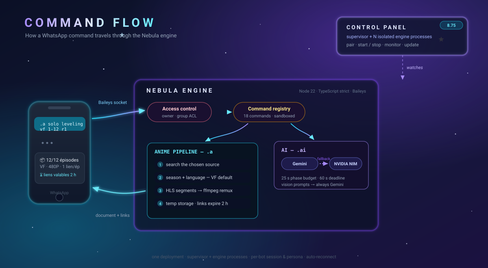
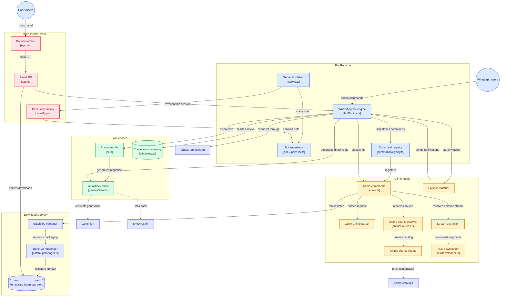

<div align="center">


# 🌌 Nebula Bot

**WhatsApp Media &amp; AI Command Center** — anime VF downloader, Gemini AI, dynamic commands and a full web control panel, in one container.

[](https://github.com/JCVERSA/p/actions/workflows/ci.yml)
[](./package.json)
[](https://nodejs.org)
[](./tsconfig.json)
[](#-tests)
[](./LICENSE)
[](https://github.com/WhiskeySockets/Baileys)
[](https://ffmpeg.org)
[](./app.ts)

</div>

---

## 🧭 Contents

**[What it looks like](#-what-it-looks-like)** · **[Features](#-features)** · **[Command Flow](#-command-flow)** · **[Architecture](#-architecture)** · **[Quick Start](#-quick-start)** · **[Anime engine](#-anime-engine)** · **[Environment variables](#-environment-variables)** · **[Tests](#-tests)** · **[Security](#-security-notes)** · **[Docs](#-documentation)** · **[Extending](#-extending)**

---

## 📸 What it looks like

Real bot output (VF by default, one high-speed link per episode, honest size labels):

```text
.a sparks of tomorrow s1 1-12 r1

📦 Nebula Novabox - Batch Media Preparation 🚀
🎬 Anime: Sparks of Tomorrow
🗣️ Language: VF          ← French dub by default (VOSTFR on request)
⚙️ Resolution: 480P
📦 Episodes to Process: 9

🚀 NEBULA NOVABOX - BATCH DOWNLOAD COMPLETED 🚀
📦 Ready Episodes: 9/9          ⏳ Links Validity: 2 Hours
📥 Direct Episode Links:
• 🎬 Episode 1: [88.93 MB]   🔗 https://your-domain/api/media/download/<token>
• 🎬 Episode 2: [89.84 MB]   🔗 …
```

The interactive flow defaults to VF too — and never lies about the language actually delivered:

```text
🎬 Novabox - Select Season 🎬
• Anime: Tomb Raider King
• Language: 🇫🇷 VF (Default)
💡 (Pour passer en VOSTFR, tape `.a vostfr`)
```

## ✨ Features

| | Feature |
|---|---|
| 📺 | **Anime VF downloader** — voir-anime.to (VF-first) with nakanime fallback, VidMoly/Voe HLS mirrors, cat-catch style segment downloader, honest quality+size labels, WhatsApp-friendly files (~90 MB/ep), MyAnimeList info cards (`.anime`, Jikan), anime identification from a screenshot (`.trace`, trace.moe) |
| 🗣️ | **VF by default** — quick mode *and* interactive menus; `.a vostfr` switches back; honest "VF non disponible" when a title has no dub |
| 🔔 | **New-episode watcher** — `.a watch` on a VF season: cron polling (default every 6 h), quiet hours 23h–7h, WhatsApp notification with the ready-made download command; `.a unwatch <title>` / `.a watchlist` |
| 📦 | **Batch episodes** — `1-12` ranges, sequential pipeline hardened for ~1 GB containers, one offline HTML download page per batch (per-episode buttons + "Tout télécharger" in Chrome, 2 h TTL), optional season ZIP via `NEBULA_BATCH_ZIP=1` |
| 🤖 | **Gemini AI** — chat, image generation, audio transcription, voice conversations with TTS, per-user daily budget + global concurrency cap; **NVIDIA NIM fallback** keeps `.ai` alive through Gemini outages (text, `meta/llama-3.3-70b-instruct` by default); defined persona (sober, mirrors the user's language, WhatsApp-tailored, overridable via `NEBULA_AI_PERSONALITY; per-conversation persistent memory (sliding 10 h TTL, rolling summary, `.ai forget`) | |
| 💬 | **WhatsApp multi-device** (Baileys) — QR **and pairing-code** linking, auto-reconnect, bad-session recovery |
| 🤖 | **Multi-bots** (8.75) — up to 8 WhatsApp bots in one deployment: per-bot process/session/persona, crash-isolated, see [docs/MULTI_BOTS.md](docs/MULTI_BOTS.md) |
| 🧩 | **Curated command set** (owner decision 8.59): `.a` anime, `.ytv`/`.ytm`/`.yts` YouTube, `.tiktok`/`.instagram` downloads, `.w` episode watch, `.ai`/`.image`, `.define`, `.sweb`, `.qr`, `.base64`, `.getpp`, `.whois`, `.ping`/`.menu`/`.help` + sandboxed panel-created ones (no fs/process/network, no restart) — the inventory is locked by a registry test; the legacy corpus, its CJS bridge (8.56), the media toolkit, moderation suite and coin system were REMOVED |
| 🛡️ | **Welcome/goodbye + RoleGuard** core wiring kept for the group experience; the moderation command suite was removed in the 8.59 curation |
| 🖥️ | **Web control panel** — live simulator, secrets manager (masked), command customizer, analytics, ZIP export |
| 🛰️ | **One-command ops** — `manage.sh start/stop/update/doctor/env/logs/clean` on any VPS, behind a Cloudflare Tunnel |

## 🔄 Command Flow



## 🏗️ Architecture



**Repo layout**

```text
server.ts (entry) ── createApp() (app.ts: auth, rate limiting, /api routes)
 ├── src/bot/botEngine.ts        Baileys socket, QR, reconnect, moderation
 ├── src/bot/commands/*.ts       individual commands (BotCommand interface)
 ├── src/bot/services/           anime clients, HLS downloader, streaming zip,
 │                               temp downloads, batch manager, proxies
 ├── src/bot/panelAuth.ts        HttpOnly session cookies (12h sliding)
 ├── app.ts                      panel SPA + media API + health
 ├── manage.sh                   VPS lifecycle: start/stop/update/doctor/env…
 └── docs/                       deployment, tunnel & migration guides
```

## 🚀 Quick Start

### On a VPS (recommended — one line)

```bash
curl -fsSL "https://raw.githubusercontent.com/JCVERSA/nebula-p/main/scripts/install.sh" | sh
```

This installs dependencies (git, Node ≥ 22, ffmpeg), clones the repo, builds it,
creates the `nebula` command available everywhere and offers the `.env` wizard.
Then:

```bash
nebula env        # APP_URL, PANEL_TOKEN, GEMINI_API_KEY… (if not done yet)
nebula start      # start + wait for the panel
```

The installer is idempotent — running it again just updates the installation.
Manual equivalent: `git clone -b main https://github.com/JCVERSA/nebula-p /root/p && cd /root/p && ./manage.sh setup`.

Then put it behind HTTPS with a Cloudflare Tunnel and set `APP_URL` —
see **[docs/MIGRATION_NOUVEAU_VPS.md](docs/MIGRATION_NOUVEAU_VPS.md)** (French, step-by-step).

Tip: `alias nebula='bash /root/p/manage.sh'` — then everything is `nebula <command>`.

### Local development

```bash
npm install
npm run dev        # panel at http://localhost:3000
```

Requirements: **Node.js ≥ 22** and `ffmpeg` on PATH for media — see [Requirements](#-requirements).

### Day-to-day operations

| Command | What it does |
|---|---|
| `./manage.sh start / stop / restart` | Lifecycle; start waits for the panel and tails the log on failure |
| `./manage.sh update` | `git pull --ff-only` → `npm install` (only if deps changed) → build → restart |
| `./manage.sh status` | Process RAM vs cgroup cap, panel + public URL probes, temp usage, disk |
| `./manage.sh logs [filter]` | Live log tail, optionally filtered (e.g. `logs NOVABOX`) |
| `./manage.sh env` | Interactive `.env` wizard — 26 documented keys, secrets masked |
| `./manage.sh doctor` | Full diagnostic: node/ffmpeg/.env/RAM/disk/network, exit 1 on blockers |
| `./manage.sh clean` | Purges orphan staging (>1h) and expired temp files (>3h) |
| `./manage.sh pair [bot] <phone>` | Links a WhatsApp number with an 8-digit pairing code (no QR needed) |
| `./manage.sh bots` | Multi-bots overview: per-bot process + WhatsApp state (8.75) |
| `./manage.sh bot <id> <start/stop/restart/status>` | Controls one bot's engine process |

## 📺 Anime engine

Built and battle-tested against real mirrors (every fix traced in
[ANIME_DOWNLOAD_AUDIT.md](ANIME_DOWNLOAD_AUDIT.md), §8.1–8.18):

- **VF by default** from `voir-anime.to` (VF guaranteed by URL structure), nakanime VOSTFR fallback, VidMoly-first mirror ranking with Voe/voembed support
- **Honest labels** — real HLS variant resolutions and sizes; a fat 403 MB "480P" is auto-downgraded to the lightest ≤480p variant (fast-lane size guard)
- **Container-friendly** — sequential batches, disk-streamed segments with backpressure, capped V8 heap, streaming (STORE) ZIP writer instead of in-RAM archives, startup debris purge
- **Resilience** — when every mirror of an episode fails (CDN-level 403), the bot retries it on the secondary anime catalog (VF lists first, then VOSTFR; honest language in the filename) — disable with `NEBULA_VOSTFR_FALLBACK=0`
- **YouTube / TikTok / Instagram** — `.ytv [360|480|720|1080]`, `.ytm` (AAC-converted audio), `.yts` (search links), `.tiktok` (no watermark, tikwm), `.instagram` (up to 20 media per post): original neb command ports with multi-API fallback chains (8.59)
- **Delivery** — batches >1 episode arrive as ONE offline HTML page: per-episode direct buttons + automatic "Tout télécharger" (temp links 2 h TTL, HTTP range streaming); single episodes still get a plain link; optional season ZIP behind `NEBULA_BATCH_ZIP=1`
- Resource ceilings: `NEBULA_NOVABOX_MAX_EPISODES` (12), `NEBULA_NOVABOX_MAX_BATCH_MB` (2048/bot), `NEBULA_TEMP_MAX_BYTES` (4 GiB), plus a cross-bot disk guard (8.78): every batch claims its ceiling in a shared claims dir and new batches are refused while free space would drop under `NEBULA_MIN_FREE_DISK_MB` (500)

## 🔑 Environment Variables

Copy `.env.example` to `.env` (or run `./manage.sh env`). Highlights:

| Variable | Required | Description |
|---|---|---|
| `APP_URL` | for public links | Public panel URL (e.g. `https://bot.example.com`). Also enables the host-header guard — must match the tunnel hostname exactly |
| `PANEL_TOKEN` | recommended | Panel access key; exchanged for an HttpOnly session cookie, never stored in the browser. Auto-generated and printed once if unset |
| `GEMINI_API_KEY` | for AI | Google Gemini key (settable from the panel, masked display) |
| `NVIDIA_NIM_API_KEY` | optional | NVIDIA NIM key — AI fallback when Gemini is unavailable (free on build.nvidia.com) |
| `PORT` | no | HTTP port (default 3000) |
| `NEBULA_VF_DEFAULT` | no | `0` disables VF-by-default |
| `NEBULA_VOIRANIME_DISABLED` | no | `1` disables the voir-anime.to source |
| `NEBULA_BATCH_ZIP` | no | `1` re-enables the all-in-one season ZIP |
| `NEBULA_BATCH_CONCURRENCY` | no | Parallel episode downloads (default 1 — sequential; keep 1 under ~1 GB RAM) |
| `NEBULA_NOVABOX_MAX_EPISODES` / `_MAX_BATCH_MB` | no | Batch ceilings (12 / 2048) |
| `NEBULA_DOWNLOAD_TIMEOUT_MS` | no | Hard global deadline per episode download (default 600000 = 10 min) |
| `NEBULA_WATCH_CRON` / `_QUIET` / `_TZ` | no | Episode watcher schedule (`0 */6 * * *`), quiet window (`23-7`) and timezone (`Africa/Douala`) |
| `NEBULA_TEMP_MAX_BYTES` | no | Temp storage ceiling (4 GiB) |
| `NEBULA_MIN_FREE_DISK_MB` | no | Cross-bot disk guard (8.78): free-space floor kept when admitting a new batch (500 MB) |
| `NEBULA_DISK_GUARD` | no | `off` disables the cross-bot disk guard |
| `NEBULA_HEALTH_SWEEP_MS` / `NEBULA_HEALTH_FAILS` | no | Supervisor health sweep (8.78): probe interval (60 s) and consecutive failures before a frozen engine is force-restarted (3) |
| `NEBULA_AI_DAILY_LIMIT` / `_MAX_CONCURRENT` | no | AI budget (40/day/user) and concurrency (3) |
| `NEBULA_PANEL_COMMANDS` | no | `off` disables sandboxed panel-created commands |
| `NEBULA_ENABLE_LEGACY` | no | `1` re-enables the vendored legacy command corpus (quarantined by default) |
| `NEBULA_DATA_DIR` / `NEBULA_ENV_FILE` / `NEBULA_AUTH_DIR` | no | Runtime state, env file and WhatsApp session locations |

Secrets can also be managed from the panel (**Settings &amp; Access → API Secrets**): values are written atomically to `.env`, applied live without restart, and only ever shown masked. Only allowlisted variables can be set from the web UI.

## 🧪 Tests

```bash
npm test           # vitest — 439 tests across 47 files
npm run lint       # strict TypeScript typecheck
npm run build      # production build (client + server)
npm start          # serve the production build (capped V8 heap, gc exposed)
```

Tests run against an isolated temp data directory and never touch real WhatsApp sessions or the Gemini API. The suite covers the anime engine (labels, language routing, fast-lane guard), the streaming ZIP writer (byte-exact round-trips), temp-download purges and start-flag regressions.

## 🔒 Security Notes

- **Panel auth:** every `/api/*` route requires login; cookies are server-side HttpOnly + CSRF-checked (Origin/Referer); bearer tokens work for tooling
- **SSRF guard:** user-supplied URLs validated per redirect hop with DNS pinning + host allowlists
- **Sandboxed commands:** panel-created commands run in a `vm` with no fs/process/network
- **Host-header guard:** foreign `Host` headers rejected when `APP_URL` is set; temp links inherit the validated base URL
- **Resource caps:** streamed downloads with byte caps, temp quotas, batch limits, AI budgets
- ZIP export never embeds your live API key; simulator output is HTML-escaped

Details: [SECURITY.md](SECURITY.md), [AUDIT_REPORT.md](AUDIT_REPORT.md).

## 📚 Documentation

| Doc | Contents |
|---|---|
| [ANIME_DOWNLOAD_AUDIT.md](ANIME_DOWNLOAD_AUDIT.md) | Full anime-download engineering log: every bug, root cause and fix (§1–8.18) |
| [docs/MIGRATION_NOUVEAU_VPS.md](docs/MIGRATION_NOUVEAU_VPS.md) | Move to a new VPS/container; Cloudflare Tunnel on a bare domain (subdomain left empty) |
| [docs/GUIDE_DEPLOIEMENT_VPS.md](docs/GUIDE_DEPLOIEMENT_VPS.md) | Zero-to-production French guide (tunnel, pairing, doctor, troubleshooting) |
| [docs/CLOUDFLARE_TUNNEL_DEPLOYMENT.md](docs/CLOUDFLARE_TUNNEL_DEPLOYMENT.md) | Cloudflare Tunnel reference (tokens, headers, checklist) |
| [docs/RAPPORT_SYSTEME_TELECHARGEMENT.md](docs/RAPPORT_SYSTEME_TELECHARGEMENT.md) | Download-system design report |
| [PHASE2_STATUS.md](PHASE2_STATUS.md) · [PHASE3_SCOPE.md](PHASE3_SCOPE.md) · [RELEASE_NOTES_v1.1.0.md](RELEASE_NOTES_v1.1.0.md) | Hardening status, roadmap, release notes |

## 🧩 Extending

- **Add a command:** drop a `BotCommand` file in `src/bot/commands/` (see `ping.ts`) — auto-loaded at startup; or generate one from the panel (sandboxed, stored as data)
- **Data flow:** WhatsApp message → engine → moderation filters → command registry → command context (`reply`, `react`, `downloadMedia`, `isOwner`, `isAdmin`)
- **Local runner:** the panel's ZIP export ships a self-contained bot (transpiled commands, Baileys runtime, config, placeholder `.env`)

---

<div align="center">

**Nebula Bot** — built container-first, validated on real mirrors. ⭐ if it saves you time.

`./manage.sh doctor` should always end with *RIEN DE BLOQUANT* 🎉

</div>
